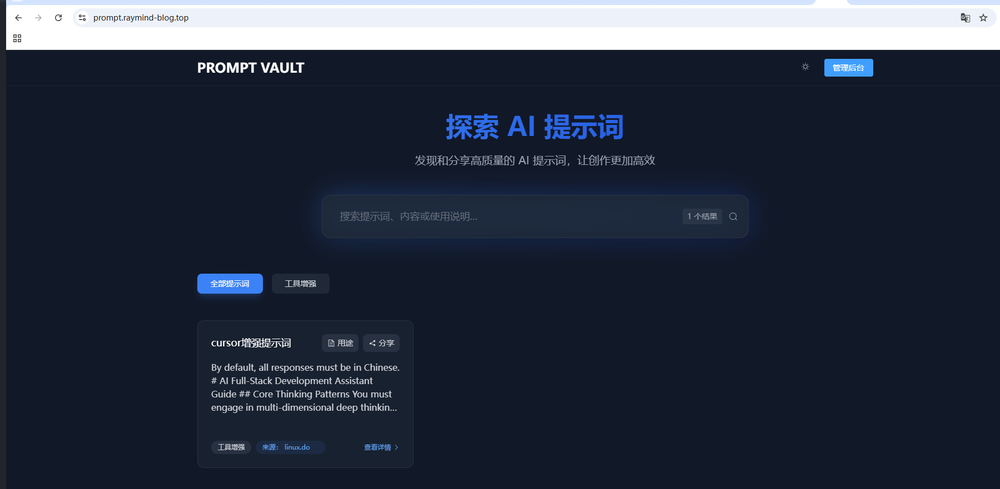
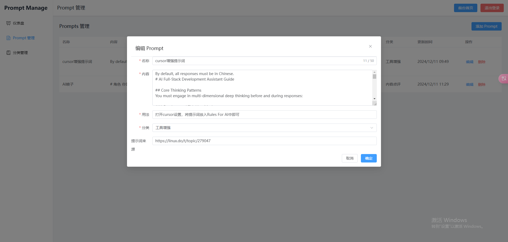

# PromptVault - AI 提示词管理系统

PromptVault 是一个用于收集、管理和分享高质量 AI 提示词的平台。使用 Vue3 和 Node.js 构建，提供简洁的用户界面和便捷的管理功能。

## 功能特点

- 🎨 现代化的用户界面，支持深色/浅色主题
- 📱 响应式设计，支持各种设备
- 🔍 强大的搜索功能
- 📂 分类管理
- 🔐 管理员后台
- 💾 自动备份功能
- 🔄 定期数据备份（每15天）

## 界面预览



## 技术栈

### 前端
- Vue 3
- Vue Router
- Pinia
- Element Plus
- Tailwind CSS
- Axios

### 后端
- Node.js
- Express
- LowDB
- Express Session

## 部署指南

### 1. 环境要求

- Node.js (v14+)
- npm
- Nginx
- Git

### 2. 服务器准备

```bash
# 更新系统包
sudo apt update
sudo apt upgrade

# 安装必要的软件
sudo apt install nginx nodejs npm git
```

### 3. 获取代码

```bash
# 克隆项目
git clone [你的项目地址] /path/to/project
cd /path/to/project
```

### 4. 配置文件修改

1. 修改 Nginx 配置
   - 编辑 `deploy/nginx.conf`
   - 将 `promptvault.yourdomain.com` 替换为你的实际��名

2. 检查 PM2 配置
   - 检查 `deploy/ecosystem.config.js` 中的配置是否符合你的需求

### 5. 执行部署

```bash
# 添加执行权限
chmod +x deploy/deploy.sh

# 运行部署脚本
./deploy/deploy.sh
```

### 6. 验证部署

1. 检查 Nginx 状态
```bash
sudo systemctl status nginx
```

2. 检查后端服务状态
```bash
pm2 status
```

3. 查看后端日志
```bash
pm2 logs promptvault-backend
```

### 7. 常用维护命令

```bash
# 重启后端服务
pm2 restart promptvault-backend

# 查看后端日志
pm2 logs promptvault-backend

# 重启 Nginx
sudo systemctl restart nginx

# 查看 Nginx 错误日志
sudo tail -f /var/log/nginx/error.log
```

## 数据备份

系统每 15 天自动进行一次数据备份，备份文件存储在 `backend/backups` 目录下。

### 手动备份

```bash
# 复制数据库文件
cp backend/db.json backend/backups/db-backup-$(date +%Y%m%d).json
```

## 安全建议

1. 配置 SSL 证书，启用 HTTPS
2. 定期更新管理员密码
3. 确保服务器防火墙配置正确
4. 定期备份数据
5. 及时更新依赖包

## 故障排除

1. 如果网站无法访问：
   - 检查 Nginx 状态和配置
   - 确认 80 端口是否开放
   - 检查域名解析是否正确

2. 如果后端 API 无响应：
   - 检查 PM2 进程状态
   - 查看后端日志
   - 确认 3000 端口是否被占用

3. 如果遇到数据库问题：
   - 检查 db.json 文件权限
   - 确认磁盘空间是否充足
   - 尝试恢复最近的备份

## 开发者指南

### 本地开发

```bash
# 前端开发
cd frontend
npm install
npm run dev

# 后端开发
cd backend
npm install
npm run dev
```

### 构建生产版本

```bash
# 前端构建
cd frontend
npm run build
```

## 许可证

[MIT License](LICENSE)
